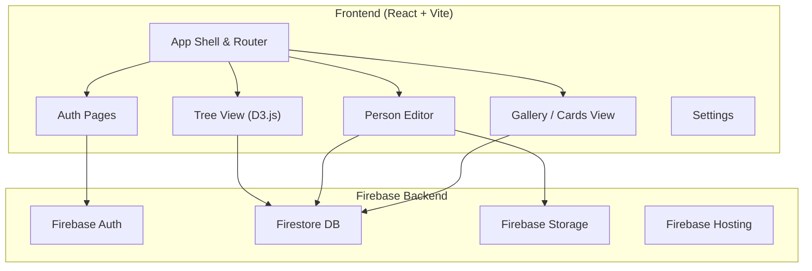

# 族谱 ZuPu — Chinese Family Tree Application

A beautiful, interactive family tree web app for recording and preserving Chinese family history across generations.

## Reference Design

The design takes inspiration from the reference image — a warm, traditional Chinese aesthetic with:
- Tree diagram visualization at the top
- Person cards with circular photos, names, relationships, and notes
- Earthy, warm color palette (beige, brown, gold tones)
- Clean, elegant typography using Chinese serif fonts

## Tech Stack

| Layer | Technology | Why |
|-------|-----------|-----|
| Framework | React 19 + Vite + TypeScript | Fast dev, type safety, you're familiar |
| Tree Viz | D3.js (d3-hierarchy) | Full control, handles 50+ nodes, beautiful SVG |
| Styling | Vanilla CSS + CSS Variables | Maximum flexibility, theme support |
| Fonts | Noto Serif SC + Inter | Elegant Chinese characters + clean Latin |
| Backend | Firebase (Auth + Firestore + Storage) | Multi-user, real-time sync, image hosting |
| Hosting | Firebase Hosting | Easy deploy, CDN, custom domain support |
| PWA | Vite PWA Plugin | Offline support, installable |

## User Review Required

> [!IMPORTANT]
> **Authentication Method**: I plan to use **Google Sign-In** as the primary auth method (simplest for family sharing). Should I also add **email/password** login?

> [!IMPORTANT]
> **Sharing Model**: Two options for multi-user access:
> - **Option A**: Owner creates tree → generates a share link → family members can view/edit with the link (simpler)
> - **Option B**: Owner invites family members by email with role-based permissions (viewer/editor/admin) (more complex but more secure)
> 
> Which do you prefer?

## Open Questions

1. **App Name**: I'm using "族谱 ZuPu" as a working title. Do you have a preferred name?
2. **Language**: Should the UI be in **Chinese only**, **English only**, or **bilingual** (with a language toggle)?
3. **Color Theme**: The reference image uses a warm, traditional palette (beige/brown/gold). Do you also want a modern dark mode, or keep it purely traditional?

---

## Architecture Overview



---

## Data Model (Firestore)

### Collections Structure

```
/trees/{treeId}
  - name: string              // "陈氏家谱"
  - ownerId: string           // Firebase Auth UID
  - rootPersonId: string      // ID of the topmost ancestor
  - theme: string             // "traditional" | "modern" | "ink"
  - shareCode: string         // for sharing access
  - createdAt: timestamp
  - updatedAt: timestamp

/trees/{treeId}/members/{memberId}
  - name: string              // "陈大明"
  - surname: string           // "陈"
  - gender: "male" | "female"
  - birthYear: string         // "1942" (string for flexibility)
  - deathYear: string | null  // "2020" or null if living
  - photoUrl: string | null
  - notes: string             // rich text notes / stories
  - side: "paternal" | "maternal" | "self"
  - parentIds: string[]       // [fatherId, motherId]
  - spouseIds: string[]       // [spouseId]
  - childrenIds: string[]     // [child1Id, child2Id, ...]
  - order: number             // birth order among siblings
  - createdAt: timestamp
  - updatedAt: timestamp

/trees/{treeId}/shares/{shareId}
  - userId: string
  - role: "viewer" | "editor"
  - joinedAt: timestamp
```

> [!NOTE]
> Using subcollections under `/trees/{treeId}/members/` keeps each family tree self-contained and makes security rules straightforward. For 4-5 generations with ~50-100 people, this is well within Firestore's performance sweet spot.

---

## Proposed Changes

### Project Initialization

#### [NEW] Project scaffold with Vite + React + TypeScript

```
/Users/chongweixin/MyHome/
├── public/
│   ├── manifest.json          # PWA manifest
│   └── icons/                 # App icons
├── src/
│   ├── main.tsx               # Entry point
│   ├── App.tsx                # Root component + router
│   ├── index.css              # Global styles + design tokens
│   │
│   ├── components/
│   │   ├── TreeView/
│   │   │   ├── TreeView.tsx       # D3.js tree visualization
│   │   │   ├── TreeView.css
│   │   │   ├── PersonNode.tsx     # Individual node in tree
│   │   │   └── PersonNode.css
│   │   ├── PersonCard/
│   │   │   ├── PersonCard.tsx     # Card view of a person
│   │   │   └── PersonCard.css
│   │   ├── PersonEditor/
│   │   │   ├── PersonEditor.tsx   # Add/edit person modal
│   │   │   └── PersonEditor.css
│   │   ├── PhotoUpload/
│   │   │   ├── PhotoUpload.tsx    # Photo upload component
│   │   │   └── PhotoUpload.css
│   │   ├── Sidebar/
│   │   │   ├── Sidebar.tsx        # Left sidebar navigation
│   │   │   └── Sidebar.css
│   │   └── common/
│   │       ├── Button.tsx
│   │       ├── Modal.tsx
│   │       └── LoadingSpinner.tsx
│   │
│   ├── pages/
│   │   ├── HomePage/
│   │   │   ├── HomePage.tsx       # Landing / dashboard
│   │   │   └── HomePage.css
│   │   ├── TreePage/
│   │   │   ├── TreePage.tsx       # Main tree view page
│   │   │   └── TreePage.css
│   │   ├── GalleryPage/
│   │   │   ├── GalleryPage.tsx    # Grid of person cards
│   │   │   └── GalleryPage.css
│   │   ├── PersonPage/
│   │   │   ├── PersonPage.tsx     # Individual person detail
│   │   │   └── PersonPage.css
│   │   ├── AuthPage/
│   │   │   ├── AuthPage.tsx       # Login / signup
│   │   │   └── AuthPage.css
│   │   └── SettingsPage/
│   │       ├── SettingsPage.tsx   # Tree settings + sharing
│   │       └── SettingsPage.css
│   │
│   ├── hooks/
│   │   ├── useAuth.ts             # Auth state hook
│   │   ├── useTree.ts             # Tree data CRUD hook
│   │   ├── useMembers.ts          # Members CRUD hook
│   │   └── usePhotoUpload.ts      # Photo upload hook
│   │
│   ├── contexts/
│   │   ├── AuthContext.tsx         # Auth provider
│   │   └── TreeContext.tsx         # Active tree provider
│   │
│   ├── services/
│   │   ├── firebase.ts            # Firebase init + config
│   │   ├── authService.ts         # Auth operations
│   │   ├── treeService.ts         # Firestore tree CRUD
│   │   └── storageService.ts      # Photo upload/delete
│   │
│   ├── types/
│   │   └── index.ts               # TypeScript interfaces
│   │
│   └── utils/
│       ├── treeLayout.ts          # D3 tree layout helpers
│       └── helpers.ts             # General utilities
│
├── firebase.json                  # Firebase config
├── firestore.rules                # Security rules
├── storage.rules                  # Storage security rules
├── .firebaserc                    # Project alias
├── index.html
├── package.json
├── tsconfig.json
└── vite.config.ts
```

---

### Design System

#### [NEW] [index.css](file:///Users/chongweixin/MyHome/src/index.css)

Design tokens inspired by the traditional Chinese aesthetic from the reference image:

- **Colors**: Warm palette — antique white backgrounds, brown/gold accents, terracotta reds, ink black text
- **Typography**: `Noto Serif SC` for Chinese headings, `Inter` for UI elements
- **Spacing**: 8px grid system
- **Borders**: Subtle, warm-toned borders with slight rounded corners
- **Shadows**: Soft, warm shadows (not cool gray)
- **Themes**: Traditional (default) + Ink Wash (水墨) + Modern Dark

```css
/* Color palette preview */
--bg-primary: #FAF6F0;          /* 宣纸白 (Xuan paper white) */
--bg-secondary: #F0E8DA;        /* 米色 (Rice color) */
--accent-primary: #8B6914;      /* 古铜金 (Antique gold) */
--accent-warm: #C4734F;         /* 赭石 (Ochre) */
--text-primary: #2C1810;        /* 墨色 (Ink black) */
--text-secondary: #6B5744;      /* 茶色 (Tea brown) */
--border-color: #D4C5A9;        /* 竹色 (Bamboo) */
--paternal-color: #8B6914;      /* Gold for paternal side */
--maternal-color: #B85C38;      /* Terracotta for maternal side */
```

---

### Tree Visualization (Core Feature)

#### [NEW] [TreeView.tsx](file:///Users/chongweixin/MyHome/src/components/TreeView/TreeView.tsx)

The heart of the app — an interactive, zoomable, pannable family tree:

- **Layout**: D3 `d3.tree()` with vertical top-down orientation
- **Nodes**: Circular photo + name label, color-coded by side (paternal/maternal)
- **Links**: Curved SVG paths connecting parent→child
- **Spouse links**: Horizontal dashed lines between spouses
- **Interactions**:
  - Click node → open person detail panel
  - Right-click / long-press → context menu (add child, add spouse, edit, delete)
  - Double-click empty space → add new person
  - Pinch-to-zoom + drag-to-pan (touch friendly)
  - Hover → highlight subtree
- **Visual editing**: Drag a node to reparent (with confirmation)
- **Side toggle**: Filter to show paternal only / maternal only / both (with smooth animation)

#### [NEW] [PersonNode.tsx](file:///Users/chongweixin/MyHome/src/components/TreeView/PersonNode.tsx)

Individual node rendering:
- Circular photo (with fallback avatar based on gender)
- Name below in Chinese characters
- Birth/death years in small text
- Colored ring: gold (paternal) / terracotta (maternal)
- Subtle glow on hover
- "+" button on hover to add connected person

---

### Person Cards & Gallery

#### [NEW] [PersonCard.tsx](file:///Users/chongweixin/MyHome/src/components/PersonCard/PersonCard.tsx)

Card-style view matching the reference image:
- Circular photo at top
- Name (姓名) prominently displayed
- Relationship label (关系) — auto-computed relative to "self"
- Brief intro (简介) preview
- Click to expand into full detail

#### [NEW] [GalleryPage.tsx](file:///Users/chongweixin/MyHome/src/pages/GalleryPage/GalleryPage.tsx)

Grid layout of all PersonCards:
- Filterable by side (paternal/maternal)
- Searchable by name
- Sortable by generation / name / birth year

---

### Person Detail & Editor

#### [NEW] [PersonEditor.tsx](file:///Users/chongweixin/MyHome/src/components/PersonEditor/PersonEditor.tsx)

Slide-out panel or modal for adding/editing a person:
- Photo upload with crop/resize
- Name (姓名) input
- Gender selector
- Birth year / Death year
- Side selector (paternal 父系 / maternal 母系)
- Relationship picker (select parent, spouse)
- Notes editor (rich text with markdown support)
- Save / Cancel / Delete buttons

---

### Authentication & Sharing

#### [NEW] [AuthPage.tsx](file:///Users/chongweixin/MyHome/src/pages/AuthPage/AuthPage.tsx)

- Google Sign-In button (primary)
- Email/password option (if confirmed)
- Beautiful landing page with traditional Chinese decorative elements

#### [NEW] [SettingsPage.tsx](file:///Users/chongweixin/MyHome/src/pages/SettingsPage/SettingsPage.tsx)

- Tree name and settings
- Share link generation
- Member management (who has access)
- Theme selection
- Export options (future: PDF, image)

---

### Firebase Setup

#### [NEW] [firebase.ts](file:///Users/chongweixin/MyHome/src/services/firebase.ts)

Firebase initialization with:
- Auth (Google provider)
- Firestore
- Storage
- Performance monitoring (optional)

#### [NEW] [firestore.rules](file:///Users/chongweixin/MyHome/firestore.rules)

Security rules:
- Tree owners have full read/write
- Shared users have read (viewers) or read/write (editors)
- Members subcollection inherits parent tree permissions

#### [NEW] [storage.rules](file:///Users/chongweixin/MyHome/storage.rules)

- Photos stored under `/trees/{treeId}/photos/{memberId}`
- Only authenticated tree members can upload
- Max file size: 5MB

---

### PWA Support

#### [NEW] [manifest.json](file:///Users/chongweixin/MyHome/public/manifest.json)

- App name: 族谱 ZuPu
- Theme color matching traditional palette
- Icons in multiple sizes

#### [NEW] [vite.config.ts](file:///Users/chongweixin/MyHome/vite.config.ts)

- Vite PWA plugin configuration
- Service worker for offline caching
- Asset precaching

---

## Implementation Phases

### Phase 1 — Foundation (Core)
1. Scaffold project (Vite + React + TS)
2. Design system (CSS variables, fonts, global styles)
3. Firebase setup (Auth + Firestore + Storage)
4. Auth pages (Google Sign-In)
5. Basic routing

### Phase 2 — Tree Visualization
6. D3.js tree layout engine
7. Person nodes with photos
8. Zoom/pan controls
9. Paternal/maternal side differentiation (color coding)
10. Click-to-select interaction

### Phase 3 — Data Entry & Editing
11. Person editor (add/edit modal)
12. Photo upload with preview
13. Relationship picker (parent/spouse/child)
14. Notes editor
15. Visual editing (right-click context menu on tree)

### Phase 4 — Gallery & Detail Views
16. Person cards grid (Gallery page)
17. Person detail page (full notes, photos)
18. Search and filter

### Phase 5 — Sharing & Polish
19. Share link generation
20. Role-based access
21. Theme selector (Traditional / Ink Wash / Modern Dark)
22. PWA setup + offline support
23. Firebase Hosting deploy

---

## Verification Plan

### Automated Tests
- Build verification: `npm run build` completes without errors
- TypeScript: `npx tsc --noEmit` passes

### Browser Testing
- Verify tree renders correctly with sample data (5 generations)
- Test add/edit/delete person flow
- Test photo upload
- Test paternal/maternal side toggle
- Test zoom/pan on tree
- Test responsive layout on mobile viewport
- Verify Chinese characters render correctly with proper fonts
- Test Google Sign-In flow

### Manual Verification
- Deploy to Firebase Hosting and test on real mobile device
- Verify PWA install prompt appears
- Test sharing flow between two different accounts
